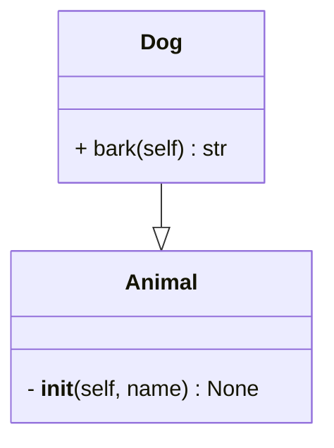

# py-mermaider

`py-mermaider` is a tool written in Rust designed to generate [mermaid.js](https://github.com/mermaid-js/mermaid) class diagrams from Python code. By analyzing Python code, `py-mermaider` automatically generates mermaid.js-compatible diagrams that represent the class structures, including classes, methods, attributes, and their relationships. This tool aims to simplify the documentation process for Python projects, making it easier to visualize class hierarchies and relationships.

[](https://opensource.org/licenses/MIT)

## Features

- **Automatic Class Diagram Generation**: Generate detailed class diagrams from Python codebases with minimal configuration.
- **Mermaid.js Compatibility**: Outputs diagrams in mermaid.js markdown syntax, ready to be embedded in your markdown documents or rendered using mermaid.js tools. GitHub supports this natively as you'll see below!

## Installation

Ensure you have Rust installed on your system. This project is not currently available as a crate or binary, so it'll have to be compiled on your machine with `cargo build --release`. You'll find the executable in `./target/release/`

## Usage

```bash
pymermaider [OPTIONS] <PATH>
```

### Arguments

- `<PATH>`
  The path to a file or directory to process.

### Options

- `-m, --multiple-files`
  When processing a directory, this option will generate an individual Mermaid file for each file within the directory.

- `-o, --output <OUTPUT>`
  Specify the output directory for the generated Mermaid files. Defaults to `./output` if not provided.

- `-h, --help`
  Display help information for the command.

- `-V, --version`
  Show the current version of `pymermaider`.

---

NOTES:

- Some codebases are so massive that processing the directory into one file will result in mermaid code that's too large to render. By default, it's 50,000 characters. This is a good reason for the `-m` flag. You can break class diagrams apart more easily into multiple renderings.

## Example

Given a Python file `example.py` with the following content:

```python
class Animal:
    def __init__(self, name: str) -> None:
        self.name = name

class Dog(Animal):
    def bark(self) -> str:
        return "Woof!"
```

Running py-mermaider on this file will provide:



## Future Additions

- ~~Output directory option~~ ✅
- ~~Better output file naming convention~~ ✅
- Import resolution (sorta-kinda implemented now, but not good enough or even used yet)
- More language support, maybe?? 😳🤔
- Sort classes with relationships to be grouped together
- Test suites!

## Known Issues

- methods with property-setter decorators can be confusing in the output

## Contributing

Contributions are more than welcome, just make a PR and we'll go from there!

## License

This project is licensed under the MIT license. Please see the
[LICENSE](LICENSE) file for more details.
