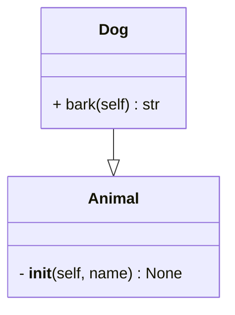

# pymermaider

[](https://github.com/astral-sh/ruff)
[](https://pypi.python.org/pypi/pymermaider)
[](https://github.com/diceroll123/pymermaider/blob/master/LICENSE)
[](https://github.com/diceroll123/pymermaider/actions)
[](https://pypi.python.org/pypi/pymermaider)

**[Try the online pymermaider playground!](https://diceroll123.github.io/pymermaider/)** *powered by WebAssembly* 🎉

`pymermaider` is a tool written in Rust designed to generate [mermaid.js](https://github.com/mermaid-js/mermaid) class diagrams from Python code. By analyzing Python code, `pymermaider` automatically generates mermaid.js-compatible diagrams that represent the class structures, including classes, methods, attributes, and their relationships. This tool aims to simplify the documentation process for Python projects, making it easier to visualize class hierarchies and relationships.

## Features

- **Automatic Class Diagram Generation**: Generate detailed class diagrams from Python codebases with minimal configuration.
- **Mermaid.js Compatibility**: Outputs diagrams in mermaid.js markdown syntax, ready to be embedded in your markdown documents or rendered using mermaid.js tools. GitHub supports this natively as you'll see below!

## Installation

pymermaider is [available on PYPI](https://pypi.org/project/pymermaider/):

```bash
# With pip.
pip install pymermaider

# With pipx.
pipx install pymermaider
```

## Usage

```bash
pymermaider [OPTIONS] <PATH>
```

### Arguments

- `<PATH>`
  Path to a file or directory. Use '-' to read Python source from stdin.

### Options

- `-m, --multiple-files`
  Process each file individually, outputting a mermaid file for each file. Only used when path is a directory.

- `-o, --output-dir <OUTPUT>`
  Output directory for mermaid files. [default: ./output]

- `--output-format <OUTPUT_FORMAT>`
  Output file format. [default: md] [possible values: md, mmd]
    - *`mmd` may become the default in the future, depending on user feedback*

- `--output <OUTPUT>`
  Output file path. Use '-' to write to stdout. Not compatible with `--multiple-files`.

- `--direction <DIRECTION>`
  Class diagram direction. [default: TB] [possible values: TB, BT, LR, RL]

- `--no-title`
  Omit the title from the diagram output.

- `--hide-private-members`
  Hide private members (fields and methods with names starting with `_`) from the diagram.

- `-h, --help`
  Display help information for the command.

- `-V, --version`
  Show the current version of `pymermaider`.

### File Selection:

- `--exclude <FILE_PATTERN>`: Excludes specific files and/or directories from being analyzed.
- `--extend-exclude <FILE_PATTERN>`: Similar to `--exclude`, but adds additional files and directories to exclude on top of those already specified.

#### Example for `--extend-exclude`:

```bash
pymermaider /path/to/dir --extend-exclude "**/tests/*,**/docs/*"
```

This command will exclude any folders within the subdirectories of `/path/to/dir` that are named `tests` or `docs`.

### Export raw Mermaid to `.mmd`:

```bash
pymermaider /path/to/dir --output-dir ./output --output-format mmd
```

### I/O Examples

```bash
# py file -> stdout
pymermaider my_file.py --output -

# stdin -> stdout
cat my_file.py | pymermaider - --output -

# py file -> file (raw Mermaid)
pymermaider my_file.py --output-format mmd --output diagram.mmd

# directory -> stdout (single combined diagram)
pymermaider ./my_project --output - > diagram.md

# hide private members (fields and methods with names starting with _)
pymermaider my_file.py --hide-private-members --output -
```

---

### NOTES:

- Some codebases are so massive that processing the directory into one file will result in mermaid code that's too large to render. By default, it's 50,000 characters. This is a good reason for the `-m` flag. You can break class diagrams apart more easily into multiple renderings.

## Example

Given a Python file `example.py` with the following content:

```python
class Animal:
    def __init__(self, name: str) -> None:
        self.name = name

class Dog(Animal):
    def bark(self) -> str:
        return "Woof!"
```

Running pymermaider on this file will provide:



## Future Additions

- Import/type resolution powered by [ty](https://github.com/astral-sh/ty)
- More language support, maybe?? 😳🤔

## Known Issues

- methods with property-setter decorators can be confusing in the output

## Contributing

Contributions are more than welcome, just make a PR and we'll go from there!

## License

This project is licensed under the MIT license. Please see the
[LICENSE](LICENSE) file for more details.
